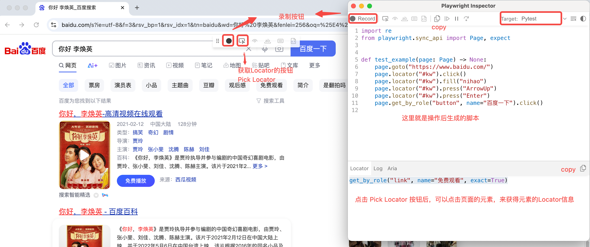
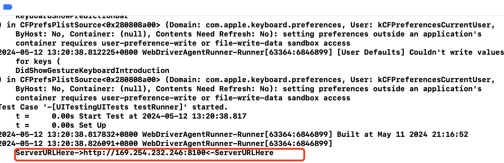
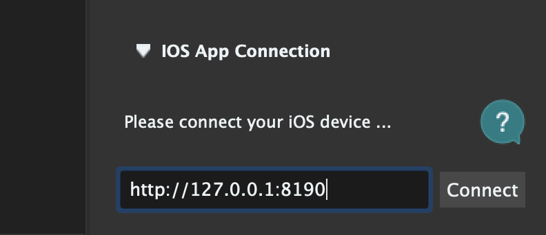
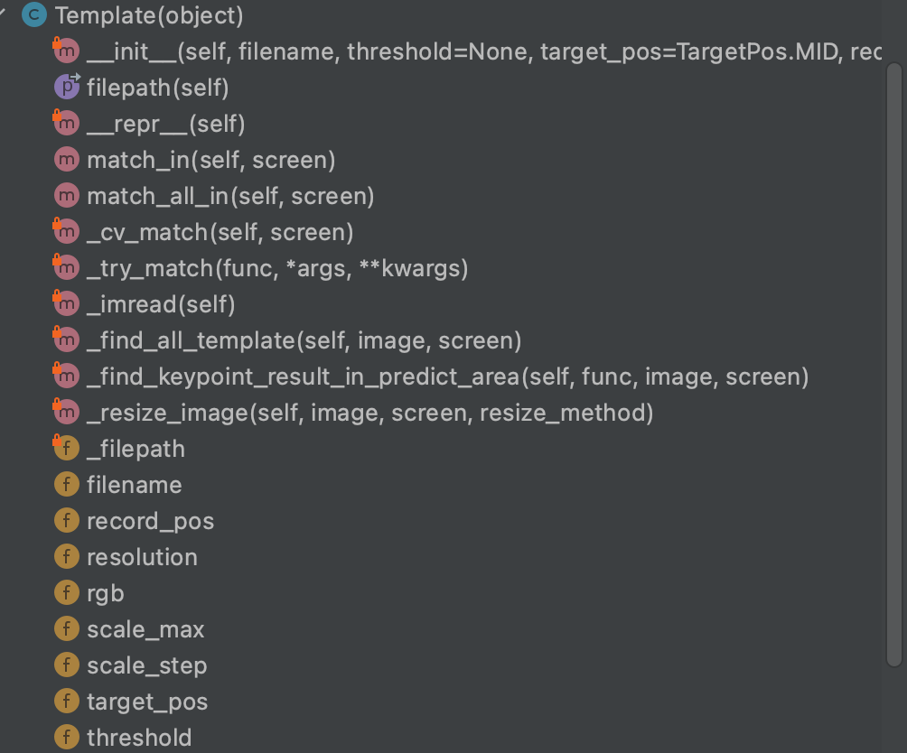

本项目介绍UI自动化测试相关的技术栈。覆盖Web和客户端(ios、android、windows、Mac 等)。


## PO模式简介

> PO模型是:Page Object Model的简写 页面对象模型
>
> PO设计模式是Selenium自动化测试中最佳的设计模式之一，主要体现在对界面交互细节的封装

就是把测试页面和测试脚本进行分离，即把页面封装成类，供测试脚本进行调用。

分层机制，让不同层去做不同类型的事情，让代码结构清晰，增加复用性。

核心思想是通过对界面元素的封装减少冗余代码，同时在后期维护中，若元素定位发生变化， 只需要调整页面元素封装的代码，提高测试用例的可维护性、可读性。

PO模式可以把一个页面分为三层，对象库层、操作层、业务层。

- 对象层：每个页面封装为一个类，属性是页面上的元素。
- 操作层：封装对页面、元素的操作，形成一个或多个操作类。
- 业务层：将一个或多个操作组合起来完成一个业务功能。比如登录：需要输入帐号、密码、点击登录三个操作。


**优点：**

1. 提高代码的可读性
2. 减少了代码的重复
3. 提高代码的可维护性，特别是针对UI界面频繁的项目

**缺点：**

1. 造成项目结构比较复杂，因为是根据流程进行了模块化处理


## Selenium

> 以下所有示例，均已Chrome浏览器为例
>
> Selenium 适用于常规的web ui


### 创建驱动

通常驱动实例名取为`driver`，是测试代码得以启动浏览器、执行相关操作的纽带，一切动作均以此为媒介。

```python
from selenium import webdriver

# 创建driver之前，通常会先创建一个浏览器的配置对象，实现对浏览器的一些配置
chromeOptions = webdriver.ChromeOptions()

# 取消浏览器打开时显示的正在监控提示
chromeOptions.add_argument('disable-infobars') 

# 添加User-Agent。对于很多网站都会限制非真实的代码请求
chromeOptions.add_argument('--user-agent=Mozilla/5.0 (Windows NT 6.1; WOW64; rv:34.0) Gecko/20100101 Firefox/34.0')

 # 添加代理。模拟真实的请求来源地址
chromeOptions.add_argument("--proxy-server=http://127.0.0.1")

# 浏览器后台运行模式，不在页面上打开窗口
chromeOptions.add_argument('--headless')

# 禁用图片及js。2是禁用, 1是允许
prefs = {
    'profile.default_content_setting_values': {
         'images': 2,
         'javascript': 2,
    }
}
options.add_experimental_option('prefs', prefs)

# 隐藏window.navigator.webdriver特征参数 （有时候能反爬）
option.add_experimental_option('excludeSwitches', ['enable-automation'])

# 创建driver时指定驱动程序。也可以将驱动程序配置到系统环境变量就可无需指定
# 注意：在新版中 executable_path 已被移除，使用Service实例来替换驱动路径
driver = webdriver.Chrome(options=chromeOptions, executable_path="libs/chromedriver")
```


### 浏览器操作

有了driver实例之后，就可以对当前拉起的浏览器做一些列操作了

```python
# 浏览器最大化 (默认是小窗口)
driver.maximize_window()

# 浏览器最小化
driver.minimize_window()

# 设置浏览器尺寸
driver.set_window_size(height, width)

# 超时时间，如果设置了，超过时间会自动停止
driver.set_page_load_timeout(20)

# 访问网站
driver.get("http://www.baidu.com")

# 刷新网站
driver.refresh()

# 通过执行js，开启一个新的窗口
js='window.open("https://www.baidu.com");'
driver.execute_script(js)

# 切换浏览器中的窗口,window_handles返回当前窗口集合，这里代表切换到第二个窗口，如果不存在第二个窗口，会报错
driver.switch_to_window(driver.window_handles[1])

# 获取当前窗口标题名
driver.title

# 获得当前窗口对象
driver.current_window_handle

# 当前url
driver.current_url

# 当前页面源代码
driver.page_source

# 截图
driver.save_screenshot('D:/baidu.png')

# 前进、回退
browser.back()
browser.forward()

# 滑动操作，下面是整个页面滑动
driver.execute_script('window.scrollBy(0,500)') # 向下滚动500个像素
driver.execute_script('window.scrollBy(0,-500)') # 向上滚动500个像素
driver.execute_script('window.scrollBy(500,0)') # 向右滚动500个像素
driver.execute_script('window.scrollBy(-500,0)') # 向左滚动500个像素

# 滑动操作，有时候需要滑动的是页面中某个部分，那么就要以这部分的元素对象作为调用方执行滑动操作
driver.execute_script("arguments[0].scrollIntoView();", ele) # ele就表示一个元素对象，将其滑动到屏幕上可见的地方
driver.execute_script("arguments[0].scrollTo(0, 500);", ele) # 将元素滚动到当前页面高度500个像素的位置
driver.execute_script('arguments[0].scrollBy(-500,0)', ele) # 向左滚动500个像素

# 关闭当前窗口
driver.close()

# 关闭整个浏览器
driver.quit()
```


### 元素定位

Selenium提供了八种定位元素方式

1. id

2. name
3. class_name：class属性
4. tag_name：标签名称
5. link_text：超链接 a标签
6. partial_link_text：超链接 a标签(模糊)
7. xpath：路径(绝对路径、相对路径)
8. CSS：选择器

通常情况下，除了项目上能保证标签id的唯一性时使用ById的方式定位意外，其他都推荐使用 **相对路径的xpath** 的定位方式，结合属性值的判断，可以很好的实现元素定位，长期看来，也更稳定。

**xpath是XML路径语言，它可以用来确定xml文档中的元素位置，通过元素的路径来完成对元素的查找。HTML就是XML的一种实现方式，所以xpath是一种非常强大的定位方式。**

xpath常用定位

- 路径
  - 绝对路径：以单斜杠开头逐级开始编写，不能跳级。如: /html/body/div/p[1]/input
  - 相对路径：以双斜杠开头，双斜杠后边跟元素名称，不知元素名称可以使用*代替。如：//input
  - 当前路径：不以斜杠开头，直接从当前路径开始往后找，也不能跳级。通常在以 元素查找子元素 时使用。如：ele.find_element(By.XPATH, 'div/div[@class="playing"]/input')
- 路径试用下标：对于同层级中多个相同标签，在确认的情况下可以使用下标，减少标签的遍历。如：/html/body/div[2]/li[3]
- 路径结合属性：在Xpath中，所有的属性必须使用@符号修饰。如: //*[@id='id值']
- 路径结合逻辑(多个属性)：//*[@id='id值' and @属性='属性值']
- 路径结合层级：//*[@id='父级id属性值']/input


Xpath拓展

```python
# 定位文本值等于XXX的元素。一般适合p标签，a标签
//*[text()='XXX']

 # 定位属性包含xxx的元素【重点】。contains为关键字，不可更改。
//*[contains(@属性,'xxx')]

# 定位属性以xxx开头的元素，同样starts-with为关键字不可更改
//*[starts-with(@属性,'xxx')] 
```


### 元素操作

```python
# 以下是元素实例常用的方法

clear # 清除元素的内容
send_keys # 模拟按键输入
click # 点击元素
submit # 提交表单
size # 获取元素的尺寸,元素在界面的高度和宽度，返回一个字典。如：{'height': 56, 'width': 78}
text # 获取元素的文本
get_attribute(name) # 获取属性值。元素都是一个标签，就是获取标签里某个属性的值
location # 获取元素坐标(左上角坐标: {'x': 22, 'y': 33})，先找到要获取的元素，再调用该方法
is_displayed() # 设置该元素是否可见
is_enabled() # 判断元素是否被使用
is_selected() # 判断元素是否被选中
tag_name # 返回元素的tagName，也就是当前元素是什么标签，比如：div、p、a
context_click(elem) # 右击鼠标点击元素elem，另存为等行为
double_click(elem) # 双击鼠标点击元素elem，地图web可实现放大功能
drag_and_drop(source,target) # 拖动鼠标，源元素按下左键移动至目标元素释放
move_to_element(elem) # 鼠标移动到一个元素上
click_and_hold(elem) # 按下鼠标左键在一个元素上

send_keys(Keys.ENTER) # 按下回车键
send_keys(Keys.TAB) # 按下Tab制表键
send_keys(Keys.SPACE) # 按下空格键space
send_keys(Kyes.ESCAPE) # 按下回退键Esc
send_keys(Keys.BACK_SPACE) # 按下删除键BackSpace
send_keys(Keys.SHIFT) # 按下shift键
send_keys(Keys.CONTROL) # 按下Ctrl键
send_keys(Keys.ARROW_DOWN) # 按下鼠标光标向下按键
send_keys(Keys.CONTROL,‘a’) # 组合键全选Ctrl+A
send_keys(Keys.CONTROL,‘c’) # 组合键复制Ctrl+C
send_keys(Keys.CONTROL,‘x’) # 组合键剪切Ctrl+X
send_keys(Keys.CONTROL,‘v’) # 组合键粘贴Ctrl+V
```


**selenium提供了ActionChains类来处理鼠标、键盘事件，如鼠标移动，点击，拖拽，键盘按下抬起等。需要导入如下模块**

```python
from selenium.webdriver.common.action_chains import ActionChains
```

**ActionChains方法列表：**

```python
# 单击鼠标左键
click(on_element=None) 

# 点击鼠标左键，不松开
click_and_hold(on_element=None)

# 点击鼠标右键
context_click(on_element=None)

# 双击鼠标左键
double_click(on_element=None)

# 拖拽到某个元素然后松开
drag_and_drop(source, target)

# 拖拽到某个坐标然后松开
drag_and_drop_by_offset(source, xoffset, yoffset)

# 按下某个键盘上的键
key_down(value, element=None)

# 松开某个键
key_up(value, element=None)

# 鼠标从当前位置移动到某个坐标
move_by_offset(xoffset, yoffset) 

# 鼠标移动到某个元素
move_to_element(to_element) 

# 移动到距某个元素（左上角坐标）多少距离的位置
move_to_element_with_offset(to_element, xoffset, yoffset)

# 在某个元素位置松开鼠标左键
release(on_element=None)

# 发送某个 key 到当前焦点的元素
send_keys(val)

# 发送某个键到指定元素
send_keys_to_element(element, keys_to_send)

# 执行链中的所有动作
perform()

# 链式写法
su = find_element_by_id("su") 
ActionChains(driver).move_to_element(su).click(su).perform()

# 控制键盘示例，按下Ctrl键然后松开
ActionChains(driver).key_down(Keys.CONTROL).key_up(Keys.CONTROL).perform()
```


### 等待

- 显式等待

  ```python
  from selenium import webdriver
  from selenium.webdriver.common.by import By
  from selenium.webdriver.support.ui import WebDriverWait
  from selenium.webdriver.support import expected_conditions as EC
  
  browser=webdriver.Chrome()
  url="https://www.taobao.com"
  browser.get(url)
  
  # 最长等待10s
  wait=WebDriverWait(browser,10)
  
  wait.until(EC.presence_of_element_located((By.ID,"q")))
  button=wait.until(EC.element_to_be_clickable((By.CSS_SELECTOR,".btn-search")))
  
  browser.close()
  ```

- 隐式等待

  ```python
  # 隐式等待
  implicitly_wait 
  ```

  隐式等待，它存在整个 WebDriver 对象实例的声明周期中，隐式的等待会让一个正常响应的应用的测试变慢，它将会在寻找每个元素的时候都进行等待，这样会增加整个测试执行的时间。

  换句话说，当查找元素或元素并没有立即出现的时候，隐式等待将等待一段时间(0.5s)再查找DOM，超出设定时间后则抛出找不到元素的异常。

  ```python
  driver = webdriver.Chrome()
  url="https://www.zhihu.com/explore"
  
  driver.get(url)
  driver.implicitly_wait(10) # 在整个session中都生效
  ```

- 线程等待

  ```python
  import time
  
  # 这就是单纯的线程等待两分钟了
  time.sleep(2)
  ```

  

### JS弹窗操作

```python
# 获取弹出框文本
driver.switch_to.alert.text

# 点击确定
driver.switch_to.alert.accept()

# 点击取消
driver.switch_to.alert.dismiss()

# 设值
driver.switch_to.alert.send_keys()
```


### 下拉框操作

```python
from selenium.webdriver.support.select import Select

# 先找到下拉框元素
driver = webdriver.Chrome()
url="https://www.zhihu.com/explore"

driver.get(url)
select_element = driver.find_element(By.XPATH)

# 创建Select实例
select = Select(select_element)

# 选择 下拉框选项
select.select_by_index(index) # 以index属性值来查找匹配的元素并选择；
select.select_by_value(value) # 以value属性值来查找该option并选择；
select.select_by_visible_text(text) # 以text文本值来查找匹配的元素并选择；
select.first_selected_option() # 选择第一个option选项；
```


## Playwright

Playwright是微软开源的web自动化测试工具。相较于Selenium更便于使用和轻量，同时支持所有现代渲染引擎，包括 Chromium、WebKit 和 Firefox等，更重要的是Playwright不仅仅提供元素定位、操作，其本身也是一个测试框架。同时也推出了Pytest框架的插件，便于用户结合Pytest使用。

### 工具安装

安装Playwright：

```shell
pip install playwright
```

Web测试都需要安装对应浏览器的驱动以及浏览器。在我们自己电脑上的浏览器通常会自动更新，也就意味着我们要不断更新驱动。因此Playwright 每个版本都绑定 自编译浏览器的某个版本，可以通过 [官方Release Note](https://playwright.dev/python/docs/release-notes) 看到对应关系，用户就可以不考虑驱动兼容的问题了。

安装浏览器：

```shell
# 这将安装Playwright自编译的所有浏览器
playwright install

# 仅安装我们需要的浏览器 chromium firefox webkit
playwright install chromium
```


简单示例：

```python
from playwright.sync_api import sync_playwright

# 启动playwright
pw = sync_playwright().start()

# 启动浏览器，返回一个Browser对象
browser = pw.chromium.launch(headless=False)

# 其他浏览器
# browser = p.firefox.launch(headless=False)
# browser = p.webkit.launch(headless=False)

# 启动用户自己安装的浏览器
# executable_path 执行可执行文件
# browser = p.chromium.launch(headless=False, executable_path='/Applications/Google Chrome.app')

# 创建一个Page对象
page = browser.new_page()
page.goto("https://www.baidu.com/")

# 打印网页标题
print(page.title())

# 输入内容进行搜索
page.locator("#kw").fill("自动化测试")
page.locator("#su").click()

# 等待页面加载，注意这里的单位 毫秒
# 另外在Playwright中不能使用time.sleep进程等待，会影响Playwright底层异步框架的逻辑
# page.wait_for_timeout(3000)

# 上面显示等待通常不推荐
# 通常建议根据目标页面某些元素是否存在来判断加载情况
page.locator(".toindex").wait_for(timeout=3000, state="visible")

# 关闭浏览器
browser.close()

# 关闭playwright
pw.stop()
```


### 元素定位

在Playwright中定位定位方式有很多，前面示例中使用的是CSS Selector的定位方式，除此之外Xpath、Role、视觉等定位方式。所有定位的结果都是一个Locator对象。


#### CSS Selector 定位

Playwright中通过css选择器定位，需要使用 Page/Frame 对象的locator方法。

1. 根据 tag名 定位

   ```python
   # 定位标签为div的元素
   # 这里定位到多个
   locators = page.locator('div').all()
   
   # inner_text 获取元素内部文本
   for locator in locators:
       print(locator.inner_text())
       
   # 注意：如果 locator调用 匹配的结果是多个元素 ， 调用 针对单个元素的方法 ，比如 inner_text ，会抛出错误
   page.locator('div').inner_text()
   ```

2. 根据 id 定位

   前面的示例中，以"#"开头的定位就是id定位，这和css的语法保持一致。通过id定位的语法是在id前面加上井号：`#id`

   ```python
   page.locator("#kw").fill("自动化测试")
   page.locator("#su").click()
   ```

3. 根据 class 定位

   前面的示例中，以"."开头的就是class定位，这和css的语法保持一致。通过class定位的语法是在class前面加上点号：`.class`

   ```python
   page.locator(".toindex").wait_for(timeout=3000, state="visible")
   ```

   我们知道在html的标签中，通常一个标签是可以有多个class属性的，像下面这样：

   ```html
   <p id="username" class="bank father">王德发</p>
   ```

   这种情况下，我们可以只使用其中一个class，也可以两个一起使用：

   ```python
   # 通过单个class定位，此处下面两个元素是一样的
   locator1 = page.locator(".bank")
   locator2 = page.locator(".father")
   
   # 使用多个class定位
   locator = page.locator(".back.father")
   ```

4. 匹配多个元素

   我们知道在一个html页面，通常有多个相同的标签，不同标签也可能有相同的class，因此基于tag和class定位，通常会匹配到多个结果，此时就要注意不能按单个元素来直接操作了。

   获取所有定位到的locator：

   ```python
   # all 方法返回一个列表，列表项是Locator实例
   locators = page.locator("div").all()
   ```

   获取定位到的locator个数：

   ```python
   count = page.locator("div").count()
   ```

   在定位到的locator中，获取我们想要的locator对象：

   ```python
   # 获取第一个
   locator = page.locator("div").first
   
   # 获取最后一个
   locator = page.locator("div").last
   
   # 获取制定下标位置处的locator，0表示第一个
   locator = page.locator("div").nth(0)
   ```

5. 元素内部定位

   前面所有的定位我们都是基于Page对象展开的，实际业务场景中我们可能还需要进一步定位，比如某个`div` 的Locator对象中还有如下两个输入框：

   ```html
   <div>
     <input id="kw" class="s_ipt username">
     <input id="kd" class="s_ipt password">
   </div>
   ```

   当我们拿到`div` 的Locator对象后，可以继续调用locator方法，实现内部元素的定位。

   ```python
   div = page.locator("div")
   
   # 定位内部的两个输入框
   ipts = div.locator(".s_ipt")
   ```

6. 子元素和后代元素定位

   先写一段html帮助理解：

   ```html
   <div id='container'>
   
       <div id='layer1'>
           <div class='inner11'>
               <span>内层11</span>
           </div>
           <div class='inner12'>
               <span>内层12</span>
           </div>
       </div>
   
       <div id='layer2'>
           <div class='inner21'>
               <span>内层21</span>
           </div>
       </div>
   
   </div>
   ```

   子元素：元素直接相邻的内部元素。比如：layer1、layer2是container的子元素；inner11、inner12又是layer1的子元素

   后代元素：元素内部所有的元素都是后代元素。比如：layer2是container的后代元素，inner21也是container的后代元素

   子元素定位：

   ```python
   # 一级子元素，最终得到 layer1 元素，层级之间使用 > 链接
   locator = page.locator("#container > #layer1")
   
   # 多级子元素，最终得到 inner12 元素
   locator = page.locator("div > #layer1 > .inner12")
   
   # 百度首页演示示例
   
   # 多级子元素定位，每一级都可以是不同的定位方式。最后的 a 标签有多个
   locator = page.locator(".wrapper_new > #head > #s-top-left > a").first
   print(locator.inner_text())  # 新闻
   ```

   后代元素定位：

   后代元素定位可以跨多个层级直接定位目标元素

   ```python
   # 层级之间使用空格隔开即可，多个空格也没关系
   locator = page.locator("#container > .inner21")
   
   # 百度首页演示示例
   
   # 后代元素定位，这里跳过了 id=head 的后代元素
   locator = page.locator(".wrapper_new #s-top-left a").first
   print(locator.inner_text())  # 新闻
   ```

7. 根据属性选择

   id、class 也是原始的属性，由于这两个很常用，所以提供了专门的语法来支持定位，而对于其他属性，我们可以使用语法`[key=value]`来定位元素。

   html片段：

   ```html
   <a href="http://map.baidu.com" target="_blank" class="mnav c-font-normal c-color-t">地图</a>
   ```

   地图标签定位：

   ```python
   locator = page.locator('[href="http://map.baidu.com"]')
   print(locator.inner_text())  # 地图
   ```

   在属性前面，还可以加上tag，比如这里的标签就是a：

   ```python
   locator = page.locator('a[href="http://map.baidu.com"]')
   print(locator.inner_text())  # 地图
   ```

   属性值也可以不写，表示元素包含这个标签：

   ```python
   # 左上角满足 a[href] 条件的有多个
   locators = page.locator('#s-top-left > a[href]').all()
   
   for lct in locators:
       print(lct.inner_text())
   ```

   属性值还支持一些匹配规则：

   ```python
   # 属性值包含某个字符串
   page.locator('a[href*="map.baidu"]')
   
   # 属性值以某个字符串开头
   page.locator('a[href^="http"]')
   
   # 属性值以某个字符串结尾
   page.locator('a[href$="com"]')
   ```

   也支持多个属性同时参与定位：

   ```python
   locator = page.locator('a[href="http://map.baidu.com"][target="_blank"]')
   print(locator.inner_text())  # 地图
   ```

8. 组选择

   css选择器支持多个选择条件同时定位多个元素，中间用 逗号 隔开。多个条件如果还是子元素或后代元素的形式，那么每个条件都以绝对路径的形式开始定位，避免混淆。

   通过id同时定位：

   ```python
   locators = page.locator('#kw, #su').all()
   
   locators[0].fill("自动化测试")
   locators[1].click()
   
   page.locator(".toindex").wait_for(timeout=3000, state="visible")
   
   # 等待3s看页面结果
   page.wait_for_timeout(3000)
   ```

9. 按次序选择子节点

   当子元素有多个相同的元素时，可以选择某一个我们需要的元素进行定位。

   ```python
   # 从开头下标开始定位
   # 注意：这里的下标是从1开始的。顺数第二个
   locator = page.locator('#s-top-left > a:nth-child(2)')
   print(locator.inner_text())  # hao123
   
   # 从结束下标开始定位。倒数第四个
   locator = page.locator('#s-top-left > a:nth-last-child(4)')
   print(locator.inner_text())  # 网盘
   
   # 从开头开始某个类型的元素
   locator = page.locator('#s-top-left > a:nth-of-type(2)')
   print(locator.inner_text())  # hao123
   
   # 从结束开始某个类型的元素。可以看到按类型的倒数第四个元素已经不是 网盘 了
   locator = page.locator('#s-top-left > a:nth-last-of-type(4)')
   print(locator.inner_text())  # 图片
   
   # 其他：
   # 偶数节点  a:nth-child(even)
   # 奇数节点  a:nth-child(odd)
   # 按类型的偶数节点  nth-of-type(even)
   # 按类型的奇数节点  nth-of-type(odd)
   ```

10. 兄弟节点选择

    相邻兄弟节点用 加号 连接：

    ```python
    # 定位左上角元素后面的 div 元素
    locator = page.locator('#s-top-left + div')
    ```

    节点后面所有的兄弟节点用 波浪号 连接：

    ```python
    # 定位左上角元素后面的 div 元素
    locator = page.locator('#s-top-left ~ div')
    ```

    

#### Xpath 定位

Playwright中的Xpath定位和selenium中的Xpath表达式是一样的，通常不推荐直接使用Xpath定位，仅在不能使用css选择器时使用。这里不再过多赘述，定位方式和css一样，把Xpath表达式放入locator中定位即可。


#### 文本定位

有时我们想获取包含某些文字的元素，通过前面的定位方式就显得不太方便了。那么可以使用 `get_by_text` 方法。

要注意，这里是包含，不是精确匹配。还是以百度首页为例：

```python
locator = page.get_by_text("新闻").all()

for lct in locator:
    print(lct.inner_text())  

"""
新闻
互联网新闻信息服务许可证11220180008
"""
```

另外， `get_by_text` 方法还支持传入正则表达式，如此就能实现各种匹配关系的元素定位了。

```python
import re

# 获取文本内容以 号 字结尾的元素
locator = page.get_by_text(re.compile("号$")).all()

for lct in locator:
    print(lct.inner_text())

"""
京ICP证030173号
网络文化经营许可证： 京网文〔2023〕1034-029号
药品医疗器械网络信息服务备案（京）网药械信息备字（2021）第00159号
医疗器械网络交易服务第三方平台备案凭证（京）网械平台备字（2020）第00002号
药品网络交易服务第三方平台备案凭证（京）网药平台备字〔2023〕第000002号
"""
```


#### 等待时间

Playwright中，对元素定位并进行操作，如果定位时元素并不存在，此时程序也是不会报错的，因为Playwrght设置了默认等待时间，时长是30s，在30s内元素被加载出来就不会报错。

这一点相比于Selenium对用户更友好，用户不需要随时都考虑元素延迟加载的问题。当然这个等待时间也是可以被修改的。

```python
from playwright.sync_api import sync_playwright

# 启动playwright
pw = sync_playwright().start()

# 启动浏览器，返回一个Browser对象
browser = pw.chromium.launch(headless=False)
page = browser.new_page()

# 设置当前Page的定位超时时间为10毫秒
page.set_default_timeout(10)
page.goto("https://www.baidu.com/")

locator = page.get_by_text("新闻").all()

for lct in locator:
    print(lct.inner_text())

# 修改为10毫秒之后，代码报错
```

另一种修改超时时间的方式：

```python
from playwright.sync_api import sync_playwright

# 启动playwright
pw = sync_playwright().start()

# 启动浏览器，返回一个Browser对象
browser = pw.chromium.launch(headless=False)

# 通过创建上下文管理器，设定超时时间，这样所有的新page都不需要单独配置了
context = browser.new_context()
context.set_default_timeout(10)

page = context.new_page()

page.goto("https://www.baidu.com/")

locator = page.get_by_text("新闻").all()

for lct in locator:
    print(lct.inner_text())
```


### 页面操作

#### 元素操作

1. inner_text：Locator定位到单个元素时，获取元素的内部**可见**文本

2. all_inner_texts：Locator定位到多个元素时，获取所有匹配的**可见**文本，放到列表中返回

3. text_content、all_text_contents：这两个方法用于获取 单个/多个 元素内部所有内容，包含不可见（`style='display:none'`）的

4. get_attribute：获取元素的属性

   ```python
   locator = page.locator('a[href="http://map.baidu.com"]')
   print(locator.get_attribute("class"))  # mnav c-font-normal c-color-t
   ```

5. inner_html：获取元素内部的整个html文本

6. click、dbclick：单击/双击 元素

7. hover：让鼠标悬停在元素上方

8. wait_for：等待元素某个状态的出现。该方法两个入参，分别是 timeout 和 state，timeout仍然是毫秒为单位，state有几个取值：

   - attached。等待元素在DOM树中存在
   - dettached。等待元素在DOM树中消失
   - visible。元素可见，可能在DOM树中存在，但可能css中设置了`visibility:hidden`或`display:none`，又或者元素没有任何内容都不认为是可见的
   - hidden。元素不可见。在DOM中不存在，或设置了隐藏属性、或没有任何内容都认为是hidden状态

9. is_visible：元素是否可见。该方法不会等待，直接返回当前元素的可见状态，True/False

10. press：基于元素按键盘键。接受一个按键参数，例如："Backspace"、"Enter"、"ArrowUp"


#### 输入框操作

1. fill：文本输入。无论是`input`单行文本框还是`textarea`多行文本框，都可以用本方法

2. clear：清空文本框。无论是`input`单行文本框还是`textarea`多行文本框，都可以用本方法

3. input_value：获取输入框（单行/多行）内容，注意输入框元素**不能**使用`inner_text`来获取文本内容

4. set_input_files：给输入框上传文件，针对上传类型的输入框，该方法可以上传一个或多个文件

   输入框：

   ```html
   <input type="file" multiple="multiple">
   ```

   定位并上传文件：

   ```python
   # 先定位
   lct = page.locator('input[type=file]')
   
   # 单选一个文件
   lct.set_input_files('d:/1.png')
   
   # 或者 多选 文件
   lct.set_input_files(['d:/1.png', 'd:/2.jpg'])
   ```

5. radio单选/checkbox多选。当`input`标签的`type`属性的值是 `radio` 或 `checkbox` 时，使用以下几个方法进行点选：

   1. check：点选输入框
   2. uncheck：取消点选输入框
   3. is_checked：判断输入框是否被选中

6. select元素操作

   select元素通常是下拉框，需要使用`select_option`方法。

   示例html：

   ```html
   <div>
   <h4 style="color: rgb(22, 118, 173)">单选</h4>
   <p>姓名:</p>
   <select id="single">
       <option value="jack">jack</option>
       <option value="simith">simith</option>
       <option value="joker">joker</option>
   </select>
   
   <hr>
   <h4 style="color: rgb(22, 118, 173)">多选</h4>
   <p>课程:</p>
   <select id="multi" multiple="">
     <option value="jack">jack</option>
     <option value="simith">simith</option>
     <option value="joker">joker</option>
   </select> 
   </div>
   ```

   

   select单选：

   ```python
   # 根据 索引 选择， 从0开始， 但是为0的时候，好像有bug
   page.locator('#single').select_option(index=1)
   
   # 根据 value属性 选择
   page.locator('#single').select_option(value='jack')
   
   # 根据 选项文本 选择
   page.locator('#single').select_option(label='jack')
   
   # 清空所有选择
   page.locator('#single').select_option([])
   ```

   

   select多选：

   ```python
   # 根据 value属性 或者 选项文本 多选
   page.locator('#multi').select_option(['jack', 'simith'])
   
   # 根据 value属性 多选
   page.locator('#multi').select_option(value=['jack', 'simith'])
   
   # 根据 选项文本 多选
   page.locator('#multi').select_option(label=['jack', 'simith'])
   
   # 清空所有选择
   page.locator('#multi').select_option([])
   
   # 需要注意，同一元素多次选择option，如果参数中没有指明之前的选项，则会直接清空之前勾选的option，以最后一次select_option
   ```

   

   获取选中的option：

   > 此处，`表达式 :checked` 是伪选择，也是一种css选择器语法，用于获取被选中的select选项。
   >
   > 前面的radio、checkbox点选输入框，同样可以使用这个语法获取被点选的对象。

   ```python
   page.locator('#multi').select_option(['jack', 'simith'])
   
   # 获取所有被勾选的option。
   lct = page.locator('#ss_multi option:checked').all_inner_texts()
   print(lct)
   ```


#### 网页操作

#### 网页操作

网页操作都基于Page对象。

1. goto：根据入参网址打开网页

2. reload：刷新当前页面

3. go_back：回退网页

4. go_forward：前进网页

5. content：获取当前page整个网页的html源码

6. title：获取网页标题栏文本

7. press：用法与Locator的press一样，不过基于Page对象的press，第一个入参数selector，先定位到元素再press

8. set_viewport_size：设置当前网页页面大小

   ```python
   page.goto("http://www.baidu.com")
   page.set_viewport_size({"width": 720, "height": 540})
   page.reload()
   ```


#### Frame切换

在html中，`frame`/`iframe`标签包裹的是另一份完整的html文档。而Playwright打开一个网页时，默认操作范围是当前的html，并没有包含被嵌套的html文档。

因此，想要操作frame标签内的元素，首先要定位到frame。可以直接使用Page或Locator对象的`frame_locator`方法，定位方式和前面其他元素定位方式一样。

比如有这样一段html：

```html
<div id="niceboy">
    <iframe src="demo.html" id='card' name='demoFrame' width="300" height="200"></iframe>
</div>
```

那么可以这样定位到`iframe`:

```python
# 返回一个FrameLocator对象，它是Locator的兄弟类，都继承了SyncBase
frame = page.frame_locator("iframe[src='demo.html']")

# 再在其内部进行定位其他元素
lct = frame.locator('xxx')
```


#### 窗口切换

在实际业务中，通常会存在打开一个新页面的测试场景，并且需要去操作新页面中的元素。此时，我们就需要用到 `BrowserContext` 对象来帮我们管理多个Page对象了。

按照之前的代码方式，访问百度首页然后点 新闻 跳转到新页面：

```python
from playwright.sync_api import sync_playwright

pw = sync_playwright().start()
browser = pw.chromium.launch(headless=False)
page = browser.new_page()

# 访问首页并点击 新闻 链接
page.goto("http://www.baidu.com")
page.locator("#s-top-left > a[href='http://news.baidu.com']").click()

# 尝试定位新闻页面的元素
# 这里会报超时的错误
page.get_by_text("热点要闻").wait_for(timeout=5000)

# 关闭浏览器
browser.close()
pw.stop()
```

上面的代码中，尝试定位 百度新闻 页面的元素会报超时错误，因为对于page对象来说，它本身并没有发生改变，只是在测试过程中产生了另一个新的Page对象。因此，在操作新页面的元素前，我们要先切换page。将上面的代码做一些修改：

```python
from playwright.sync_api import sync_playwright

pw = sync_playwright().start()
browser = pw.chromium.launch(headless=False)

# 创建上下文管理器
context = browser.new_context()

# 通过上下文管理器创建页面
page = context.new_page()

# 访问首页并点击 新闻 链接
page.goto("http://www.baidu.com")
page.locator("#s-top-left > a[href='http://news.baidu.com']").click()

# 等待一个新页面加载
# 新页面加载后会给到context一个'page'事件
context.wait_for_event("page")

# 打印当前打开的页面数量
print(len(context.pages))  # 2

# 通过新页面定位新闻页面的元素
new_page = context.pages[1]
new_page.get_by_text("热点要闻").wait_for(timeout=5000)

# 当有多个页面时，为了便于我们调试，我们可以把某个页面切换为当前活动窗口
page.bring_to_front()

# 手动等一下看效果
page.wait_for_timeout(3000)

# 注意：有多个页面不方便管理时，我们也可以直接关闭某个页面
new_page.close()
page.close()

# 关闭浏览器
browser.close()
pw.stop()
```

上面代码中用到了context的event，event有以下一些取值：

- backgroundpage：在上下文中创建新的背景页面时触发，这仅适用于Chromium浏览器的上下文
- close：浏览器上下文关闭时触发
- console：上下文当页面内的js调用了控制台方法时触发
- dialog：上下文页面中出现新的对话框时触发，例如 `alert`、`prompt`、`confirm` 或 `beforeunload`，监听特定页面弹出窗口事件使用`page.on('dialog')`
- page：上下文中创建新页面时触发，监听特定页面弹出窗口事件使用`page.on('popup')`
- request：上下文中任何页面出发请求时触发，监听特定页面使用`page.on('request')`
- requestfailed：上下文页面请求失败时触发，监听特定页面使用`page.on('requestfailed')`
- requestfinished：上下文页面请求完成时触发，监听特定页面使用`page.on('requestfinished')`
- response：当收到请求的 response状态和标头时触发。对于成功响应，事件顺序为 `request`、`response` 和 `requestfinished`。要监听来自特定页面的响应事件，请使用 `page.on('response')`
- serviceworker：在上下文中创建新的 Service Worker 时触发，，这仅适用于Chromium浏览器的上下文
- weberror：当此上下文中的任何页面中的异常未处理时触发，要监听特定页面的错误，请改用 `page.on('pageerror')`


#### 截屏

Page对象支持截屏，直接使用`screenshot`方法即可：

```python
# 可见区域截屏，保存到当前工作目录下的page.png文件中
page.screenshot(path='page.png')

# 完整页面截屏，页面内容长度超过窗口高度时，包括不可见部分。
page.screenshot(path='page.png', full_page=True)
```

元素也支持截屏，使用Locator 对象的`screenshot`方法：

```
page.locator('input[type=file]').screenshot(path='ss2.png')
```


#### 拖拽

事先准备好html代码：

```html
<span id="t1">t1</span>
<span id="t2">t2</span>

<form >
  <div id="content">
  </div>
  <input type="text" placeholder="content" />
  <button type="submit">Submit</button>
</form>
```


1. 基于Page对象拖拽，使用`drag_and_drop`方法

   ```python
   # 选中 span#t1 文本内容
   page.locator('#t1').select_text()
   
   # 拖拽到 输入框 [placeholder="content"] 里面去
   page.drag_and_drop('#t1', '[placeholder="content"]')
   ```

2. 基于Locator对象拖拽，此时就是把当前元素内容拖拽到目标元素了，使用`drag_to`方法

   ```python
   lct = page.locator('#t1')
   
   # 选中 span#t1 文本内容
   lct.select_text()
   
   # 拖拽到 输入框 [placeholder="content"] 里面去
   lct.drag_to(page.locator('[placeholder="content"]'))
   ```

   

#### 对话框操作

弹出的对话框有三种类型，分别是 `alert（警告信息）` 、 `confirm（确认信息）` 和 `prompt（提示输入）`，需要注意的是任意一种对话框出现，都必须先完成对话框的操作，让对话框消失后才能继续页面的其他操作。

Playwright在界面有弹出框时，如果没有注册事件回调函数，会自动点击取消让代码得以继续进行。

用deepseek帮我写了一个html，可以弹出以上三种弹窗：

```html
<!DOCTYPE html>
<html lang="zh-CN">
<head>
    <meta charset="UTF-8">
    <meta name="viewport" content="width=device-width, initial-scale=1.0">
    <title>对话框示例</title>
</head>
<body>
<div class="button-container">
    <button id="alert" onclick="showAlert()">显示 Alert</button>
    <button id="confirm" onclick="showConfirm()">显示 Confirm</button>
    <button id="prompt" onclick="showPrompt()">显示 Prompt</button>
</div>
<script>
    function showAlert() {
        alert("这是一个警告对话框！");
    }
    function showConfirm() {
        const result = confirm("这是一个确认对话框，您确定要继续吗？");
    }
    function showPrompt() {
        const name = prompt("请输入您的名字：", "张三");
    }
</script>
</body>
</html>
```


**Alert**

Alert 弹出框，目的是显示通知信息，需要用户点击确认按钮。在网页切换的部分，讲到了上下文和page的事件监听，这些监听都支持传入一个回调函数，用于事件的后处理。

```python
from playwright.sync_api import sync_playwright, Dialog

pw = sync_playwright().start()
browser = pw.chromium.launch(headless=False)
page = browser.new_page()

# 加载本地页面
page.goto("file:///Users/seeker/PycharmProjects/UiAutoTest/tests/test_playwright/dialog.html")

# 处理 弹出对话框 的 回调函数
def callback(dialog: Dialog):
    # 等待1秒
    page.wait_for_timeout(1000)
    # 点击确定
    dialog.accept()
    # 打印 弹出框 提示信息
    print(dialog.message)  # 这是一个警告对话框！

# 监听页面的 'dialog' 事件
# 这个相当于给页面绑定了一个监听事件，并能触发事件回调
page.on("dialog", callback)

# 点击alert按钮触发弹窗
page.locator("#alert").click()
```


**Confirm**

Confirm对话框，主要是让用户确认是否要进行某个操作。

```python
from playwright.sync_api import sync_playwright, Dialog

pw = sync_playwright().start()
browser = pw.chromium.launch(headless=False)
page = browser.new_page()

# 加载本地页面
page.goto("file:///Users/seeker/PycharmProjects/UiAutoTest/tests/test_playwright/dialog.html")

# 处理 弹出对话框 的 回调函数
def callback(dialog: Dialog):
    # 等待1秒
    page.wait_for_timeout(1000)
    # 点击确定
    dialog.accept()

page.on("dialog", callback)

# 点击confirm按钮触发弹窗
page.locator("#confirm").click()
```


**Prompt**

Prompt 对话框 需要用户输入信息，然后提交。Prompt的dialog对象的`accept`方法可以接受一个参数，作为输入的内容，并同步完成确认点击。

```python
from playwright.sync_api import sync_playwright, Dialog

pw = sync_playwright().start()
browser = pw.chromium.launch(headless=False)
page = browser.new_page()

# 加载本地页面
page.goto("file:///Users/seeker/PycharmProjects/UiAutoTest/tests/test_playwright/dialog.html")

# 处理 弹出对话框 的 回调函数
def callback(dialog: Dialog):
    # 等待1秒
    page.wait_for_timeout(1000)
    # 输入内容并确定
    dialog.accept("赵四")
    
    print(dialog.message)  # 请输入您的名字：

page.on("dialog", callback)

# 点击confirm按钮触发弹窗
page.locator("#prompt").click()
```


### 脚本录制

Playwright提供脚本录制功能，可以帮我们快速生成测试脚本 或 生成Locator定位信息。

语法是 `playwright codegen URL`，比如用下面指令，打开百度首页的录制窗口：

```shell
playwright codegen http://www.baidu.com
```

打开网页时，除了网页浏览器窗口，还有一个脚本检查窗口，像下面这样：



上图中，Record是手动关闭了。可以看到操作过程被完整的记录下来了。基于上图做几点说明：

1. 通过命令行打开网页时，默认是开启录制的，即Record按钮默认是红色录制状态
2. 生成的脚本是可以切换 编程语言 和 测试框架的，右上角的 `Target: Pytest` 就是在录制完之后切换的，对应的脚本也完成了转换
3. Pick Locator 按钮需要停止录制后才会出现，便于获取单个的Locator信息
4. 不管是脚本还是Locator信息，都可以直接复制
5. 还有一些其他功能键，例如：清空、暂停 等，尝试用一用便清晰可知


### Pytest插件

这部分摘自playwright官方文档。

#### Introduction

Playwright provides a Pytest plugin to write end-to-end tests. 

```python
# install plugin
pip install pytest-playwright
```


#### Usage

To run your tests, use Pytest CLI.

```bash
pytest --browser webkit --headed
```

If you want to add the CLI arguments automatically without specifying them, you can use the pytest.ini  file:

```ini
# content of pytest.ini
[pytest]
# Run firefox with UI
addopts = --headed --browser firefox
```


#### CLI arguments

Note that CLI arguments are only applied to the default `browser`, `context` and `page` fixtures. If you create a browser, a context or a page with the API call like browser.new_context(), the CLI arguments are not applied.

- `--headed`: Run tests in headed mode (default: headless).
- `--browser`: Run tests in a different browser `chromium`, `firefox`, or `webkit`. It can be specified multiple times (default: `chromium`).
- `--browser-channel` Browser channel to be used.
- `--slowmo` Slows down Playwright operations by the specified amount of milliseconds. Useful so that you can see what is going on (default: 0).
- `--device` Device to be emulated.
- `--output` Directory for artifacts produced by tests (default: `test-results`).
- `--tracing` Whether to record a trace for each test. `on`, `off`, or `retain-on-failure` (default: `off`).
- `--video` Whether to record video for each test. `on`, `off`, or `retain-on-failure` (default: `off`).
- `--screenshot` Whether to automatically capture a screenshot after each test. `on`, `off`, or `only-on-failure` (default: `off`).
- `--full-page-screenshot` Whether to take a full page screenshot on failure. By default, only the viewport is captured. Requires `--screenshot` to be enabled (default: `off`).


#### Fixtures

This plugin configures Playwright-specific fixtures for pytest. To use these fixtures, use the fixture name as an argument to the test function.

```python
def test_my_app_is_working(fixture_name):
    pass
    # Test using fixture_name
    # ...
```

**Function scope**: These fixtures are created when requested in a test function and destroyed when the test ends.

- `context`: New browser context for a test.
- `page`: New browser page for a test.
- `new_context`: Allows creating different browser contexts for a test. Useful for multi-user scenarios. Accepts the same parameters as browser.new_context().

**Session scope**: These fixtures are created when requested in a test function and destroyed when all tests end.

- `playwright`: Playwright instance.
- `browser_type`: BrowserType  instance of the current browser.
- `browser`: Browser instance launched by Playwright.
- `browser_name`: Browser name as string.
- `browser_channel`: Browser channel as string.
- `is_chromium`, `is_webkit`, `is_firefox`: Booleans for the respective browser types.

**Customizing fixture options**: For `browser` and `context` fixtures, use the following fixtures to define custom launch options.

- `browser_type_launch_args`: Override launch arguments for browser_type.launch(). It should return a Dict.
- `browser_context_args`: Override the options for browser.new_context(). It should return a Dict.

Its also possible to override the context options (browser.new_context()) for a single test by using the `browser_context_args` marker:

```python
import pytest

@pytest.mark.browser_context_args(timezone_id="Europe/Berlin", locale="en-GB")
def test_browser_context_args(page):
    assert page.evaluate("window.navigator.userAgent") == "Europe/Berlin"
    assert page.evaluate("window.navigator.languages") == "de-DE"]
```


#### Running Multiple Tests

If your tests are running on a machine with a lot of CPUs, you can speed up the overall execution time of your test suite by using `pytest-xdist` to run multiple tests at once:

```bash
# install dependency
pip install pytest-xdist
# use the --numprocesses flag
pytest --numprocesses auto
```

Depending on the hardware and nature of your tests, you can set `numprocesses` to be anywhere from `2` to the number of CPUs on the machine. If set too high, you may notice unexpected behavior.


#### Examples

1. **Configure typings for auto-completion**

   test_my_application.py

   ```python
   from playwright.sync_api import Page
   
   def test_visit_admin_dashboard(page: Page):
       page.goto("/admin")
       # ...
   ```

   If you're using VSCode with Pylance, these types can be inferred by enabling the `python.testing.pytestEnabled` setting so you don't need the type annotation.

2. **Using multiple contexts**

   In order to simulate multiple users, you can create multiple `BrowserContext` instances.

   test_my_application.py

   ```python
   from playwright.sync_api import Page, BrowserContext
   from pytest_playwright.pytest_playwright import CreateContextCallback
   
   def test_foo(page: Page, new_context: CreateContextCallback) -> None:
       page.goto("https://example.com")
       context = new_context()
       page2 = context.new_page()
       # page and page2 are in different contexts
   ```

3. **Skip test by browser**

   test_my_application.py

   ```python
   import pytest
   
   @pytest.mark.skip_browser("firefox")
   def test_visit_example(page):
       page.goto("https://example.com")
       # ...
   ```

4. **Run on a specific browser**

   conftest.py

   ```python
   import pytest
   
   @pytest.mark.only_browser("chromium")
   def test_visit_example(page):
       page.goto("https://example.com")
       # ...
   ```

5. **Run with a custom browser channel**

   ```bash
   pytest --browser-channel chrome
   ```

   test_my_application.py

   ```python
   def test_example(page):
       page.goto("https://example.com")
   ```

6. **Configure base-url**

   Start Pytest with the `base-url` argument. The `pytest-base-url`  plugin is used for that which allows you to set the base url from the config, CLI arg or as a fixture.

   ```bash
   pytest --base-url http://localhost:8080
   ```

   test_my_application.py

   ```python
   def test_visit_example(page):
       page.goto("/admin")
       # -> Will result in http://localhost:8080/admin
   ```

7. **Ignore HTTPS errors**

   conftest.py

   ```python
   import pytest
   
   @pytest.fixture(scope="session")
   def browser_context_args(browser_context_args):
       return {
           **browser_context_args,
           "ignore_https_errors": True
       }
   ```

8. **Use custom viewport size**

   conftest.py

   ```python
   import pytest
   
   @pytest.fixture(scope="session")
   def browser_context_args(browser_context_args):
       return {
           **browser_context_args,
           "viewport": {
               "width": 1920,
               "height": 1080,
           }
       }
   ```

9. **BrowserContext option overrides**

   conftest.py

   ```python
   import pytest
   
   @pytest.fixture(scope="session")
   def browser_context_args(browser_context_args, playwright):
       iphone_11 = playwright.devices['iPhone 11 Pro']
       return {
           **browser_context_args,
           **iphone_11,
       }
   ```

   Or via the CLI `--device="iPhone 11 Pro"`


## Airtest&Poco

> 对于app的ui自动化，目前推荐 Airtest&Poco 两个库组合使用。相较于传统的 appium，其对元素的操作以及定位都更简单已用，且对于各端（android、ios、win、mac）都有较好的适配

学习文档：https://www.bookstack.cn/read/Airtest-1.2-zh/Home.md


### Android

对于安卓设备，airtest自带了各个系统版本的ADB工具，因此只要安卓设备连接到操作系统，并且手机打开了开发者选项，那么就可以直接使用 AirtestIDE 工具，以及运行测试脚本。

在学习文档中，较为详细的介绍了如何使用airtest&poco，可以轻松实现设备连接、脚本调试，比较有特点是的可以实现步骤级别的截屏以及录屏。


### IOS

相较于android设备的测试就复杂了许多，android设备可以借助adb直接实现应用的启停，也就可以在测试时同步启动android设备上的PocoService（手机端的代理服务，测试脚本必须借助代理服务才能实现在设备界面的测试操作），轻松实现自动化测试。

对于ios，airtest的支持也不尽人意（ios-Tagent），对于ios和xcode的版本都有严重限制。但好消息是，新版本的airtest已经对appium的WebDriverAgent（WDA）有了较好的支持，详情可见：https://www.bookstack.cn/read/Airtest-1.2-zh/51422283f532b257.md


#### 安装WDA

注意，给ios设备安装WDA需要借助Mac电脑以及xcode工具，通过源码安装的方式安装程序。

1. clone 源码到本地：https://github.com/appium/WebDriverAgent.git

2. 进入项目目录，双击启动文件WebDriverAgent.xcodeproj，将在xocde中打开项目

3. 进入菜单，选择 Product > Scheme > WebDriverAgentRunner

4. 进入菜单，选择 Product > Destination > 连接的手机。在 `iOS Device` 分类下，是我们自己的设备

5. 在xcode界面，右侧 TARGETS 选择 WebDriverAgentRunner

6. 选中 Signing&Capabilities tab页面 

   1. 勾选Automatically manage signing
   2. Team中选择自己的 Apple开发帐号。如果是个人，那么登录Apple ID，就可以使用Personal Team
   3. 将 Bundle Identifier修改为：com.xxx.WebDriverAgentRunner。**注意这里的 xxx 是用户自定义的包名**

7. 选中 Build Settings tab页面，Packaging 中的 Product Bundle Identifier修改为：com.glaxxx.WebDriverAgentRunner

8. 进入菜单，点击 Product > Test ，这将执行源码安装流程，为设备安装WebDriverAgent

   > 主要注意的是，安装完成后，默认会启动agent，但首次通常会失败
   >
   > 其原因是个人Team是不被信任的，需要在手机 设置 > 通用 > VPN与设备管理 中信任开发者
   >
   > 再次运行agent，还会再让输入锁屏密码
   >
   > 这些操作完成后，再次运行 Test ，就会成功启动WDA

9. 成功启动WDA后，就可以在同一网段访问到WDA启动的代理服务，在xcode启动的WDA，在控制台就可以看到链接地址

   

10. 至此，WebDriverAgent 就安装完成了


#### tidevice

在实际测试工程中，测试设备通常在机房统一管理，但是从前面WDA安装过程可以看到，我们需要使用xcode来启动WDA，这样就失去了自动化测试的意义。出于这样的需求，阿里开源了1个用来做iOS自动化的工具-- tidevice （taobao-iphone-device），官称该工具能实现 **不依赖 xcode 启动 WebDriverAgent** 完成设备连接。

> iOS 16的手机需要手工开启开发者选项。 
>
> 开启方法：设置->隐私与安全性->开发者模式 （打开），然后会提示重启 （点击 重新启动） -> 启动后会弹窗 是否打开“开发者模式”？（点击打开）

- 安装tidevice

  目前 tidevice 库仅支持安装在 **python3.7及以上版本** 中

  ```shell
  pip3 install tidevice
  ```

- 常用命令

  查看已连接设备: `tidevice list`

  ```shell
  % tidevice list
  UDID                       SerialNumber    NAME        MarketName    ProductVersion    ConnType
  00008101-xxxx  FFX***YJ    iPhone (3)  iPhone 12     16.3.1            usb
  ```

  查看设备上第三方的应用名: `tidevice -u UDID applist`

  如果当前只连接了一台设备，那么可以省略 -u 参数

  ```shell
  % tidevice -u 00008101-xxxx applist
  
  com.tencent.qqmail QQ邮箱 6.5.3
  com.ss.iphone.ugc.Aweme 抖音 29.8.0
  com.alipay.iphoneclient 支付宝 10.3.50
  ```

  安装 .ipa 包: `tidevice -u UDID install 包路径`

  ```shell
  # $UDID可以使用tidevice list命令查看
  tidevice -u $UDID  install D:/test.ipa
  
  # 或者
  tidevice -u $UDID install https://example.org/example.ipa
  ```

  其他常用命令：

  ```shell
  # 卸载应用
  tidevice uninstall com.example.demo
  
  # 启动应用
  tidevice launch com.example.demo
  
  # 停止应用
  tidevice kill com.example.demo
  
  # 查看运行中的应用
  tidevice ps
  tidevice ps --json output as json
  ```

  更多详细的功能可以查看 tidevice 的github文档：https://github.com/alibaba/taobao-iphone-device

- 运行 XCTest（Xcode Test）

  在此之前，需保证设备已经安装了AWD

  查看设备上WDA的BundleID:

  ```shell
  % tidevice -u 00008101-00112CCA3AE0001E applist | grep 'WebDriverAgent'
  com.xxx.WebDriverAgentRunner.xctrunner WebDriverAgentRunner-Runner 1.0  # 第一列包名就是 BundleID
  ```

  指定BundleID启动应用：

  ```shell
  # 命令启动后，需要保持窗口。否则会中断连接
  % tidevice xctest -B com.xxx.WebDriverAgentRunner.xctrunner
  
  [I 240512 15:40:04 _device:1064] Start execute test plan with IDE version: 29
  [I 240512 15:40:04 _device:950] 2024-05-12 15:39:55.755581+0800 WebDriverAgentRunner-Runner[63406:6875081] ServerURLHere->http://169.254.232.246:8100<-ServerURLHere  # 设备上的代理服务地址，在同一网段中可以直接访问
  [I 240512 15:40:04 _device:951] WebDriverAgent start successfully
  ```

  上面启动的wda必须要求测试脚本运行所在的网络与设备网络在同一个网段，才能访问到设备上的代理服务，使用起来就不太方便。

  因此，再介绍一个启动方式，这个方式会在当前执行tidevice命令的机器上再提供一个代理服务（当前操作系统代理设备上的代理服务），并且可以指定端口号，这使得测试脚本无需关心设备代理服务的访问地址，就可以使用 localhost 操作设备:

  ```shell
  % tidevice wdaproxy -B com.xxx.WebDriverAgentRunner.xctrunner --port 8190
  
  [I 240512 15:54:14 _device:951] WebDriverAgent start successfully
  ```

  使用 AirtestIDE 就可以成功连接到设备:

  

  

  

#### pymobiledevice3

pymobiledevice3 是一个纯 Python3 实现，用于与 iDevices（如 iPhone 等）互动的工具。这意味着该工具既与架构无关也与平台无关，并在以下系统上得到支持和测试：

- Windows
- Linux
- macOS


此处不过多介绍，这是一个开源的工具。


### 图像识别

在Airtest中除了通过控件定位元素以外，最值得一提的就是OCR图像识别，在没法通过控件操作元素时，通过图像识别获取元素坐标并实现对应操作。

下面来分析一下其中的实现过程，其核心在于Template类，查找目标图片在当前屏幕上的位置坐标。下面看下其类结构：




1. 从 match_in 方法入手，从下面源码可以看出，其核心在于 _cv_match 方法

   ```python
       def match_in(self, screen):
           match_result = self._cv_match(screen)
           G.LOGGING.debug("match result: %s", match_result)
           if not match_result:
               return None
           focus_pos = TargetPos().getXY(match_result, self.target_pos)
           return focus_pos
   ```

2. _cv_match 方法源码如下：

   ```python
       @logwrap
       def _cv_match(self, screen):
           # 底层就是使用openCV库，读取图片信息，并且将目标图片进行缩放，方便识别
           ori_image = self._imread()
           image = self._resize_image(ori_image, screen, ST.RESIZE_METHOD)
           ret = None
           for method in ST.CVSTRATEGY:
               # get function definition and execute:
               func = MATCHING_METHODS.get(method, None)
               if func is None:
                   raise InvalidMatchingMethodError("Undefined method in CVSTRATEGY: '%s', try 'kaze'/'brisk'/'akaze'/'orb'/'surf'/'sift'/'brief' instead." % method)
               else:
                 	# 最后在 _try_match 中进行识别
                   if method in ["mstpl", "gmstpl"]:
                       ret = self._try_match(func, ori_image, screen, threshold=self.threshold, rgb=self.rgb, record_pos=self.record_pos,
                                               resolution=self.resolution, scale_max=self.scale_max, scale_step=self.scale_step)
                   else:
                       ret = self._try_match(func, image, screen, threshold=self.threshold, rgb=self.rgb)
               if ret:
                   break
           return ret
   ```

3. _try_match 源码比较简单

   ```python
       @staticmethod
       def _try_match(func, *args, **kwargs):
           G.LOGGING.debug("try match with %s" % func.__name__)
           try:
               ret = func(*args, **kwargs).find_best_result()
           except aircv.NoModuleError as err:
               G.LOGGING.warning("'surf'/'sift'/'brief' is in opencv-contrib module. You can use 'tpl'/'kaze'/'brisk'/'akaze'/'orb' in CVSTRATEGY, or reinstall opencv with the contrib module.")
               return None
           except aircv.BaseError as err:
               G.LOGGING.debug(repr(err))
               return None
           else:
               return ret
   ```

4. 继续跟进 find_best_result 方法，这里TemplateMatching中的该方法

   ```python
       @print_run_time
       def find_best_result(self):
           """基于kaze进行图像识别，只筛选出最优区域."""
           """函数功能：找到最优结果."""
           # 第一步：校验图像输入 im_source 是屏幕截图；im_search 则是目标图片
           check_source_larger_than_search(self.im_source, self.im_search)
           # 第二步：计算模板匹配的结果矩阵res
           # 本质上就是通过将两个图片都灰度化处理后，使用openCV 的matchTemplate方法找出与目标图片最匹配的部分
           res = self._get_template_result_matrix()
           # 第三步：就是获取最佳匹配的位置
           # 返回 最小值、最大值、最小匹配区域的左上坐标、最大匹配区域的左上坐标
           # 最大值最小值可以理解为匹配区域与原图的相似度，也就是距离
           min_val, max_val, min_loc, max_loc = cv2.minMaxLoc(res)
           # 获取目标图片的高和宽
           h, w = self.im_search.shape[:2]
           # 求取可信度
           confidence = self._get_confidence_from_matrix(max_loc, max_val, w, h)
           # 求取识别位置: 目标中心 + 目标区域:
           # middle_point 市中心位置坐标，rectangle 是截图上匹配区域的四个点，点序:左上->左下->右下->右上
           middle_point, rectangle = self._get_target_rectangle(max_loc, w, h)
           best_match = generate_result(middle_point, rectangle, confidence)
           LOGGING.debug("[%s] threshold=%s, result=%s" % (self.METHOD_NAME, self.threshold, best_match))
   				
           # 可信度达到阈值就返回结果
           return best_match if confidence >= self.threshold else None
   ```

5. 在上一步已经获得了匹配结果，在第一部中还有一个 TargetPos().getXY() 方法的调用，这个很简单，就是把匹配区域的中间坐标位置返回回来了。


示例，找出下面小图在大图中的位置。


直接使用Airtest的Template类完成位置查找：

```python
from airtest import aircv
from airtest.core.cv import Template

# 创建模板
t = Template("../../resource/images/ui_test05.png")

# 截屏图片，需要先read为图片对象
# 本质还是openCV读取图片
screen = aircv.imread("../../resource/images/ui_test04.png")

pos = t.match_in(screen)

print(pos)  # (487, 752)
```


